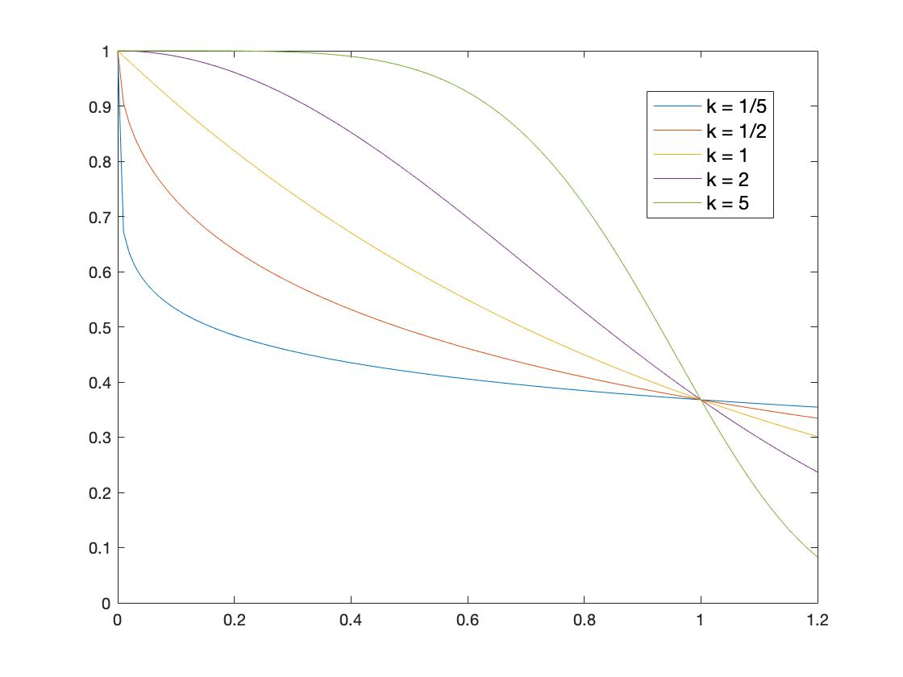

# Phi accrual failure detector with cold restarts

Well-known failure detectors (FD), such as the Phi-accrual FD, usually use the *crash-stop* model and assume there is no chance for **recovery**. However, under special cases where devices are extremely **unstable** and **frequently stop and later recover**, this assumption does not hold.

Actually, this is what we face when building the prototype of [FPGAOL](https://fpgaol.ustc.edu.cn/). Problems such as power failures, network failures and sometimes software errors may keep one node down for a period of time, but the devices could get back online very soon without human interference. However, for the QoS requirements of FPGAOL, we need to know the exact running state of a node and **"predict" whether they could keep stable in the next few minutes**.

## Our solution: Add cold restarts!

One of the characteristics of an unstable device is that it **frequently flips between up and down** n a short period of time. Thus, our solution aims to leverage this information to identify unstable devices.

Our failure detector basically maintains **two sliding windows**. The first one stores recent heartbeat information, which is used by the Phi FD. The second one stores recent records about how long the node has been on before it loses connection. We could see clearly that the second windows provides information about how *frequent* the inspected node tend to flip from up to down.

With this information, we split the lifecycle of our failure detector into **two phases**:  the start phase and the stable phase. In the start phase, the FD waits until it thinks the node is no longer in unstable state, i.e. it's unlikely to filp back down shortly, to let it go into the stable phase, where we use a normal Phi FD to detect crashes. Note that although we could reliably receive heartbeats in the start phase, we do not mark the node as *up* because we suspect it is unstable and may crash again very soon.

In the start phase, we use [**Weibull distribution**](https://en.wikipedia.org/wiki/Weibull_distribution) to decide whether a node is stable. The CDF of the distrbution is like *1 - e^((x / l) ^ k)*, and we use *e^((x / l) ^ k)*, which is ploted above. We set *l* as a configurable parameter and k is derived from the node's crash history. We could see from the plot that if we set a certain threshold, then **the smaller k is, the longer it takes to reach the threshold**. 

Thus, for a suspectedly unstable node, we give it a smaller k so that it needs to keep up for a longer time to show that that it's working stably. However, for a trusted node with better records, we could quickly push it into the stable phase. Since this difference is much like the relationship between *cold reboot* and *hot reboot*, we call it **cold-restart failure detector** (*CR-FD*). 

## Experiments

We used two **traces** to evaluate our failure detector. The first is a crash and recovery trace that is randomly generated. Although it's synthesized, it well suits our understanding of the scenerio on FPGAOL and is even more complicated. The second is a real-world user access log that is taken on FPGAOL. Both traces last 24 hours.

We first compared the number of *risky* accesses, which is the chance that a user may get a device that will crash in the next 3 minutes (FPGAOL users typically use FPGAs for less than 3 minutes each time). We could see that more than a third of risky accesses are avoided by our failure detector. Especially under cases where devices are very unstable, our FD could improve the stability of the whole system a lot.

|       | Phi-FD | CR-FD |
| :---: | :----: | :---: |
| Risky |  124   |  80   |

We then analyzed the accuracy (the decision of our FD is the same as the fact) and recall(our FD detects the failure). We could see that our FD performs almost as good as Phi-FD, although we have more false negatives for suspectedly unstable nodes.

|        | Accuracy | Recall |
| :----: | :------: | :----: |
| Phi-FD |  0.999   | 0.998  |
| CR-FD  |  0.975   | 0.999  |